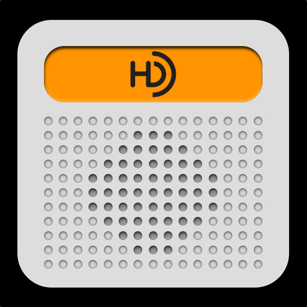
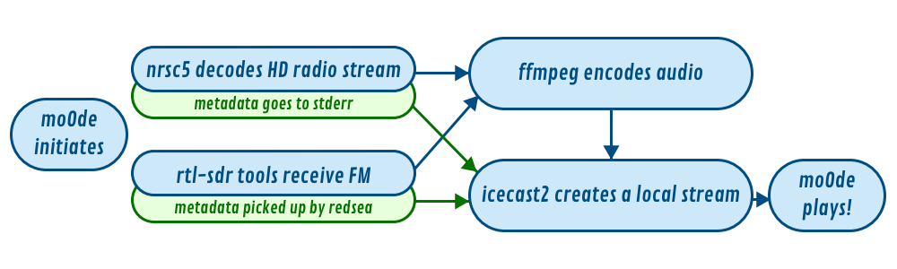

Personal project only!

Anyone who stumbles upon this is welcome to take it, use it, make it better.

No support, warranty, or any other crap is provided.

# HD-Radio and FM Radio for moOde audio

A Frankenstein's monster to add over-the-air US FM and multicast FM (HD) stations to moOde audio's Radio list using an RTL-SDR dongle. There's no scanning or auto-adding of stations to moOde.

Works with moOde 10.

- For HD-Radio, it uses **nrsc5** by theori-io (https://github.com/theori-io/nrsc5) to decode signals from an RTL-SDR dongle attached to the Raspberry Pi. Artist/Title are scraped from the nrsc5 stderr and sent to Icecast2 as metadata.
- For standard FM radio, it uses **rtl-sdr** tools with RDS info picked up by **redsea** by windytan (https://github.com/windytan/redsea).
- The audio is re-encoded by **ffmpeg/libmp3lame** and sent along with any station/artist/song info to Icecast2.
- **Icecast2** sets up a local stream that is interpreted by moOde audio as a webradio station.

Add stations to moOdeaudio with a URI that tunes the frequency and multicast channel:
- http://127.0.0.1:8080/tune?freq=93.3&prog=0 (for HD. prog 0 is HD-1)
- http://127.0.0.1:8081/fmtune?freq=102.3 (for FM.)

## Notes to Self for moOde major releases

- Remember to enable services (sudo systemctl enable ###.service) in /etc/systemd/system.
- Runtime and build dependencies: git build-essential cmake autoconf libtool libao-dev libfftw3-dev librtlsdr-dev meson libsndfile1-dev libliquid-dev python3-flask icecast2.
- Remember to set icecast passwords in /etc/icecast2/icecast.xml, /usr/local/bin/fm-run, and hd-run.
- Icecast doesn't need configuration during install. The file here is all that's needed.
- nrsc5 and redsea need to be compiled and installed (see respective github repos).
- add user to plugdev and audio groups (sudo usermod -aG plugdev [username] and sudo usermod -aG audio [username]).
- All files should have both their location and their permissions included (for bad memory reasons).
